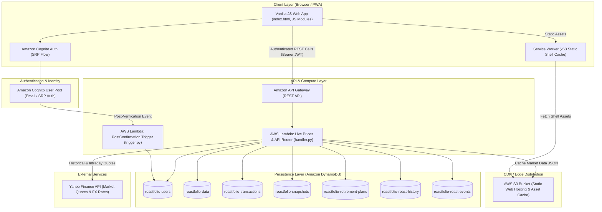
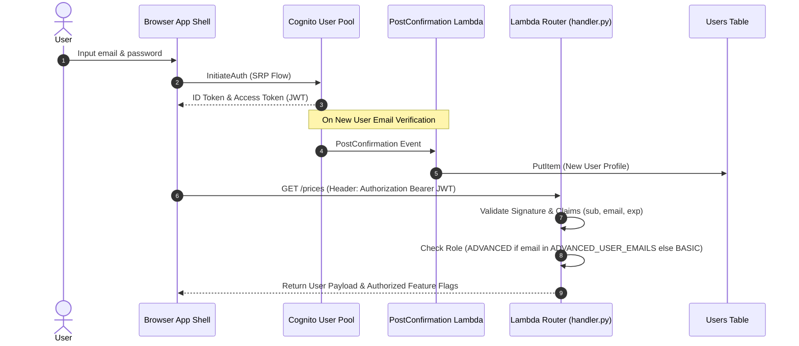

# Roastfolio — Technical Architecture & System Reference

## 1. System Overview & Infrastructure Architecture

Roastfolio (Emerytura Investment Dashboard) is a high-performance, serverless financial portfolio analytics and tracking platform. The application provides real-time market data, historical valuation snapshots, AVCO (Average Cost) accounting, gamified analytics, FIRE retirement forecasting, and sarcastic market commentary.

### High-Level Architecture Diagram



---

## 2. Database Schema & Data Models

Roastfolio uses Amazon DynamoDB (Pay-Per-Request / On-Demand) organized with single-table design patterns for core entity groups alongside dedicated tables for high-throughput ledgers and temporal snapshot series.

### Table Schema Summary

| Table Name | Primary Key (`PK` / `HASH`) | Sort Key (`SK` / `RANGE`) | Description | Secondary Indexes (GSIs) |
| :--- | :--- | :--- | :--- | :--- |
| `roastfolio-users` | `userId` (String UUID) | *None* | User profile metadata, settings, subscription tier | `email-index` (`email` -> `userId`, `nickname`) |
| `roastfolio-data` | `userId` (String UUID) | `sk` (String) | Single-table: Portfolios (`PORTFOLIO#<pid>`), Holdings (`HOLDING#<pid>#<id>`), AVCO (`AVCO#<pid>`) | *None* |
| `roastfolio-transactions` | `userId` (String UUID) | `sk` (`PORTFOLIO#<pid>#TX#<YYYY-MM-DD>#<txId>`) | Chronological trade ledger for asset & cash transactions | *None* |
| `roastfolio-snapshots` | `userId` (String UUID) | `sk` (`PORTFOLIO#<pid>#SNAPSHOT#<YYYY-MM-DD>`) | Historical daily valuation snapshots, ATH records (`...#ATH`) | *None* |
| `roastfolio-retirement-plans`| `userId` (String UUID) | `sk` (`PLAN#<planId>`) | FIRE retirement plans and saved Monte Carlo forecast results | *None* |
| `roastfolio-roast-history` | `userId` (String UUID) | `createdAt` (String ISO-8601) | Sarcastic roast history logs with TTL expiration | TTL on `expiresAt` |
| `roastfolio-roast-events` | `templateId` (String) | `createdAt` (String ISO-8601) | Global commentary template triggering telemetry | `user-events-index` (`userId`, `createdAt`) |

---

### Detailed Key Schemes & Item Layouts

#### 1. `roastfolio-data` (Portfolios & Holdings)
- **Portfolio Item**:
  - `PK`: `<userId>`
  - `SK`: `PORTFOLIO#<portfolioId>`
  - Attributes: `portfolioId`, `name`, `type` (`"real"`), `currency` (`"PLN"` \| `"USD"` \| `"EUR"`), `color`, `order`, `createdAt`, `updatedAt`
- **Holding Item**:
  - `PK`: `<userId>`
  - `SK`: `HOLDING#<portfolioId>#<holdingId>`
  - Attributes: `portfolioId`, `holdingId`, `name`, `ticker` (e.g., `"XTB.WA"`, `null` for cash), `currency`, `units` (Decimal), `purchaseValue` (Decimal cost basis in PLN), `updatedAt`

#### 2. `roastfolio-transactions` (Trade Ledger)
- `PK`: `<userId>`
- `SK`: `PORTFOLIO#<portfolioId>#TX#<YYYY-MM-DD>#<transactionId>`
- Attributes: `transactionId`, `portfolioId`, `holdingId`, `type` (`"BUY"` \| `"SELL"` \| `"DIVIDEND"` \| `"SPINOFF"` \| `"DEPOSIT"` \| `"WITHDRAWAL"` \| `"EXTRA_COST"` \| `"CASH_ADJUSTMENT"`), `ticker`, `name`, `currency`, `quantity`, `price`, `value`, `commission`, `tax`, `comment`, `transactionDate`, `createdAt`, `updatedAt`

#### 3. `roastfolio-snapshots` (Historical Daily Valuation)
- `PK`: `<userId>`
- `SK`: `PORTFOLIO#<portfolioId>#SNAPSHOT#<YYYY-MM-DD>`
- Attributes:
  - `snapshotDate`: `"YYYY-MM-DD"`
  - `totalValuePLN`: Net portfolio value in PLN
  - `costBasisPLN`: Total invested capital / cost basis in PLN
  - `unrealizedPLN`: `totalValuePLN - costBasisPLN`
  - `unrealizedPct`: Percentage gain/loss
  - `dailyChangePLN`: 1-day absolute PLN change
  - `dailyChangePct`: 1-day percentage change
  - `xirr`: Annualized internal rate of return percentage
  - `holdings`: Map of historical holding snapshots (`units`, `pricePLN`, `valuePLN`)

---

## 3. Subsystems & Data Flows

### A. Authentication & Role Authorization



- **Feature Gating**: Role is assigned dynamically based on environment configuration (`ADVANCED_USER_EMAILS`). BASIC users receive locked UI tab access for advanced ledger features, while ADVANCED users receive full raw transaction ledger controls.

---

### B. Transaction Ingestion & AVCO Analytics Engine

The AVCO (Average Cost Basis) engine processes chronological asset transactions to calculate current position cost basis, realized gains, spinoff adjustments, wash-sale violations, and sarcastic bagholder badges.

```mermaid
flowchart TD
    A[Save/Update Transaction API] --> B{Valid Payload?}
    B -- No --> C[Return 400 Error]
    B -- Yes --> D[Derive holdingId from Ticker/Name]
    D --> E[DynamoDB TransactWriteItems: Write TX Item]
    E --> F[Rebuild Holdings from Ledger]
    F --> G[Replay Chronological Transactions in AVCO Engine]
    
    subgraph AVCO ["PortfolioAVCOCalculator"]
        G --> H{Transaction Type}
        H -- BUY / SPINOFF --> I[Update Position Units & Weighted AVCO Price]
        H -- SELL --> J[Calculate Realized Gain = Units * (SellPrice - AVCO)]
        J --> K[Check Wash-Sale: Loss sale rebuy within 30 days]
        H -- DIVIDEND --> L[Add to Received Dividends]
    end

    AVCO --> M[Persist AVCO#portfolioId in roastfolio-data]
    M --> N[Trigger Snapshot Recalculation from Transaction Date]
```

#### AVCO Position Badge Logic
- **Clown Bagholder**: Active value `< 10 PLN` with historical peak value `> 250 PLN` following a major loss sale (`<= -20%`).
- **Paper Hands FOMO**: Position closed with minor gain (`< 5%`), followed by market rally where asset price rose `>= +30%` post-closure.
- **Wash Sale Violator**: Re-bought asset within 30 days after realizing a loss sale.

---

### C. Historical Snapshot & Snapshot Recalculation Engine

The snapshot calculation engine constructs daily historical portfolio valuations for performance charts, sparklines, and XIRR rate-of-return calculations.

```mermaid
flowchart LR
    A[recalculate_portfolio_snapshots_from_date] --> B[Fetch All Chronological Ledger Transactions]
    B --> C[Query Historical Price Data Range via YFinance]
    C --> D[Apply 14-Day Lookback Window for Market Close Prices]
    
    D --> E{Asset Ticker?}
    E -- GPW stock (*.WA) --> F[Resolve Currency = PLN (Prevent Double FX)]
    E -- Foreign Stock/ETF --> G[Apply USD/EUR FX Rate]
    E -- Foreign Cash --> H[Apply Historical FX Conversion]
    
    F & G & H --> I[Compute Daily Net Asset Value & Cost Basis]
    I --> J[Calculate 1-Day Daily Change & XIRR]
    J --> K[Batch Write Snapshot Items to roastfolio-snapshots]
```

#### Critical Robustness Guarantees:
1. **14-Day Lookback Buffer**: Market price lookups incorporate a 14-day preceding lookback window. Non-trading days (weekends, market holidays) resolve to the last available trading close price instead of returning `None` (preventing artificial portfolio value collapses on weekends).
2. **Market Currency Resolution**: Polish GPW equities (`.WA`) explicitly map to `PLN`, preventing double FX currency conversion when holding or portfolio default currency is set to USD or EUR.
3. **Graceful AVCO Oversell Clamping**: If legacy transaction ledgers contain minor floating-point oversell discrepancies, `_process_sell` clamps sold units to available active units without failing snapshot batch writes.

---

### D. Live Data & Performance Caching Strategy

To deliver instant PWA load times, Roastfolio employs a dual-stage fetch architecture alongside Service Worker shell caching:

1. **Lite View (`GET /prices?view=lite`)**:
   - Returns cached holding balances, latest snapshot values, and gauge metrics.
   - Executes in `< 50ms`.
2. **Full View Background Prefetch (`GET /prices?view=full`)**:
   - Triggered asynchronously in the background.
   - Fetches live YFinance market prices, intraday benchmark changes (`^GSPC`, `WIG.WA`), ticker carousel data, and updates S3 cache buckets.
3. **Service Worker (`src/service-worker.js` - Cache Version `roastfolio-v63`)**:
   - **Shell-First Strategy**: HTML, CSS, JavaScript modules, and app icons are served instantly from cache, revalidated in background.
   - **Never-Cache Rules**: API endpoints (`/lambda/`, `amazonaws.com`) and authentication calls bypass SW cache for live execution.

---

## 4. API Endpoint Directory

All endpoints are hosted on Amazon API Gateway and routed via `lambda/handler.py`. Requests require a valid `Authorization: Bearer <ID_TOKEN>` header (except CORS preflight `OPTIONS`).

### Portfolios & Ledger Endpoints

| Method | Endpoint Path | Description | Authorization |
| :--- | :--- | :--- | :--- |
| `GET` | `/prices` | Get portfolio data, holdings, main gauge, live market prices | Bearer JWT |
| `GET` | `/portfolios` | List all user portfolios | Bearer JWT |
| `POST` | `/portfolios` | Create a new portfolio wallet | Bearer JWT |
| `PUT` | `/portfolios/{id}` | Update portfolio settings (name, color, order) | Bearer JWT |
| `DELETE`| `/portfolios/{id}` | Delete portfolio and associated holdings/snapshots | Bearer JWT |
| `GET` | `/portfolios/{id}/transactions` | List portfolio transactions | Bearer JWT |
| `POST` | `/portfolios/{id}/transactions` | Record a new transaction | Bearer JWT |
| `PUT` | `/portfolios/{id}/transactions/{txId}` | Update an existing transaction | Bearer JWT |
| `DELETE`| `/portfolios/{id}/transactions/{txId}` | Delete a transaction | Bearer JWT |

### Snapshots & Analytics Endpoints

| Method | Endpoint Path | Description | Authorization |
| :--- | :--- | :--- | :--- |
| `GET` | `/portfolios/{id}/snapshots` | Retrieve daily portfolio snapshot series | Bearer JWT |
| `POST` | `/portfolios/{id}/snapshots/recalculate` | Trigger snapshot recalculation from specified date | Bearer JWT |
| `GET` | `/portfolios/{id}/avco` | Get AVCO analytics, positions, realized returns, badges | Bearer JWT |
| `GET` | `/portfolios/{id}/ath` | Get All-Time-High celebration data and history | Bearer JWT |

### FIRE & Retirement Plan Endpoints

| Method | Endpoint Path | Description | Authorization |
| :--- | :--- | :--- | :--- |
| `GET` | `/retirement-plans` | List user retirement plans | Bearer JWT |
| `PUT` | `/retirement-plans` | Save retirement plan parameters | Bearer JWT |
| `POST` | `/retirement-plans/{id}/simulate` | Run Monte Carlo retirement simulation | Bearer JWT |

---

## 5. CI/CD & Deployment Architecture

Deployments are managed via AWS SAM (Serverless Application Model) and CloudFormation templates (`template.yaml`).

### Deployment Environment Configuration

```mermaid
gitGraph
    commit id: "dev-init"
    branch test
    branch prod
    checkout dev
    commit id: "feat-avco-fix"
    checkout test
    merge dev id: "deploy-test-stack"
    checkout prod
    merge dev id: "deploy-prod-stack"
```

- **Branching Strategy**:
  - `dev`: Primary development branch.
  - `test`: Automated deployment to isolated `dev-roastfolio-*` stack via GitHub Actions (`deploy-test.yml`).
  - `prod`: Production deployment to live `roastfolio-*` infrastructure via GitHub Actions (`deploy-prod.yml`).
- **CloudFormation Resources Created**:
  - 1 AWS Lambda Function (`emerytura-live-prices`, Python 3.12 runtime, 512MB RAM, 60s timeout).
  - 1 AWS Lambda Cognito Trigger Function (`roastfolio-cognito-trigger`).
  - 7 Amazon DynamoDB Tables (`PAY_PER_REQUEST` billing with Point-In-Time Recovery enabled).
  - 1 Amazon Cognito User Pool & User Pool Client.
  - 1 Amazon API Gateway REST API with CORS enabled.
